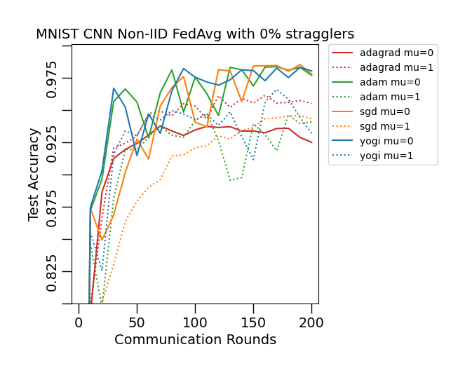
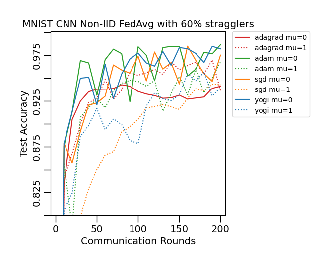
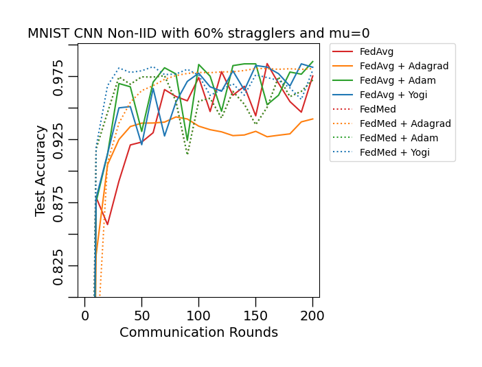

# Exploring optimization and regularization methods in Federated Learning

Project for the CS-439 course (Optimization for Machine Learning). Check-out the description [here](docs/miniproject_description.pdf).

[Here](https://www.overleaf.com/project/6415ca8ec4888a6faeb0192a) is the final report (WIP).

## Plan of action

<details>
<summary>View steps</summary>
<p>

- [x] Get familiar with [Flower](https://github.com/adap/flower) 

- [x] Centralized setting

  - [x] Implement PyTorch data loading
  
  - [x] Implement PyTorch training
  
  - [x] Implement PyTorch testing

- [x] Distributed setting

  - [x] Implement Flower Client 

  - [x] Write data partitionning methods
  
  - [x] Distribute data amongst clients
  
- [x] Write plotting functions
 
  - [x] Distributed setting
  
  - [x] Centralized setting
  
- [x] Use parser to set parameters

- [x] Use config manager

- [x] Make optimizer modular

- [x] Create custom client optimizers

    - [x] SGD
        
    - [x] Adam 
        
    - [x] RMSProp
    
 - [x] Add different strategies

    - [x] FedMedian

    - [x] FedKrum

- [x] Add server side optimizers

    - [x] Adagrad

    - [x] Adam

    - [x] Yogi
    
- [ ] Play around with different methods

  - [ ] SGD 

    ```sh
    python distributed.py -m STRATEGY=fedavg,fedmedian,fedkrum \
                             client_optim_name=sgd \
                             client_optim_args.lr=0.01 \
                             server_optim_name=sgd,adagrad,yogi,adam \
                             PROXIMAL_MU=0.0,1.0 \
                             NUM_ROUNDS=200 \
                             NUM_CLIENTS=10 \
                             STRAGGLERS_FRACTION=0.0,0.6 
    ```
    
  - [ ] Adam 

    ```sh
    python distributed.py -m STRATEGY=fedavg,fedmedian,fedkrum \
                             client_optim_name=adam \
                             client_optim_args.lr=0.001 \
                             server_optim_name=sgd,adagrad,yogi,adam \
                             PROXIMAL_MU=0.0,1.0 \
                             NUM_ROUNDS=200 \
                             NUM_CLIENTS=10 \
                             STRAGGLERS_FRACTION=0.0,0.6 
    ```
  
  - [ ] RMSprop

    ```sh
    python distributed.py -m STRATEGY=fedavg,fedmedian,fedkrum \
                             client_optim_name=rmsprop \
                             client_optim_args.lr=0.01 \
                             server_optim_name=sgd,adagrad,yogi,adam \
                             PROXIMAL_MU=0.0,1.0 \
                             NUM_ROUNDS=200 \
                             NUM_CLIENTS=10 \
                             STRAGGLERS_FRACTION=0.0,0.6 
    ```
</p>
</details>

## Install

`Poetry` is recommended for installing the dependencies: `poetry install`.

But a `requirements.txt` file is also present in order to install the dependencies with `pip`: `pip install -r requirements.txt`.

## Centralized setting

To run the MNIST digit recognition task in a centralized setting, the following command can be used:

```sh
python centralized.py
```

## Distributed setting

To run MNIST digit recognition task in a distributed setting, the following command can be used:

```sh
python distributed.py
```

## Changing parameters

The `--help` flag can be used to display the different parameters that can be changed.

# Results

Comparing different mu values with FedAvg and SGD as a client side optimizer with 0% stragglers we have:



Comparing different mu values with FedAvg and SGD as a client side optimizer with 60% stragglers we have:



Comparing different strategies with mu set to 0 and SGD as a client side optimizer with 60% stragglers we have:



